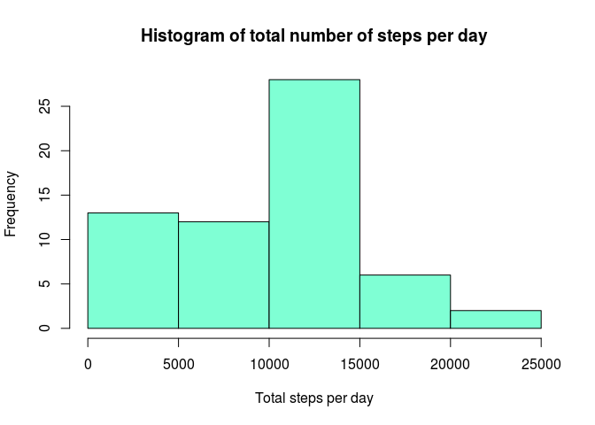
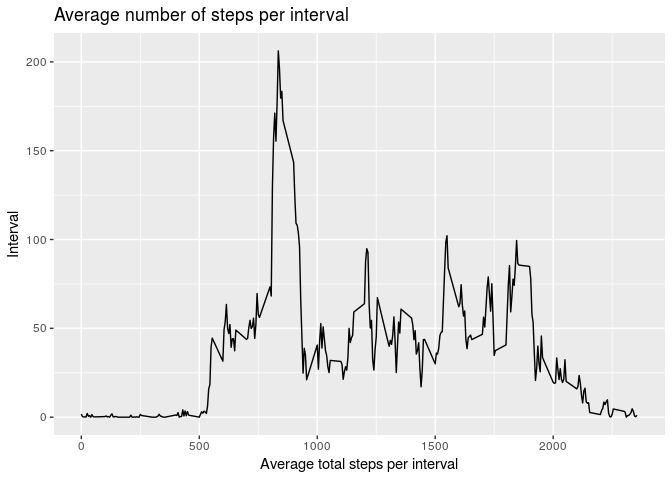
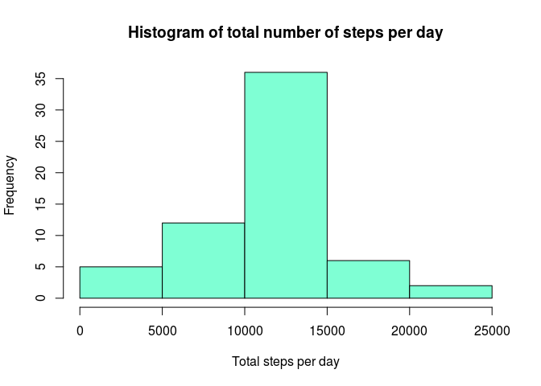
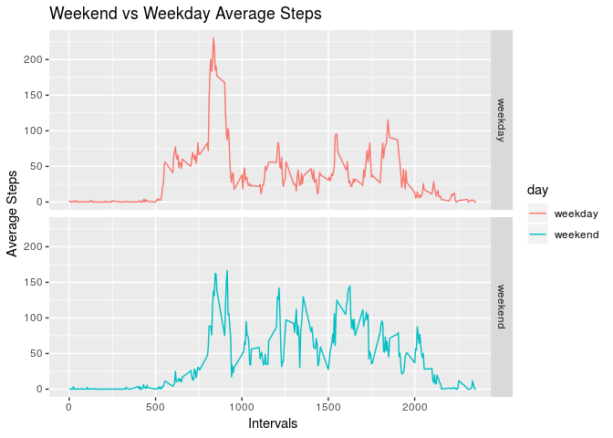

## Loading required packages

```r
library(ggplot2)
library(dplyr)
```

```
## 
## Attaching package: 'dplyr'
```

```
## The following objects are masked from 'package:stats':
## 
##     filter, lag
```

```
## The following objects are masked from 'package:base':
## 
##     intersect, setdiff, setequal, union
```

```r
library(knitr)
library(lattice)
```

## Loading and preprocessing the data.

I convert the date to Date format.


```r
unzip("activity.zip")
data <- read.csv("activity.csv")
Sys.setlocale("LC_TIME", "C")
```

```
## [1] "C"
```

```r
data$date <- as.Date(data$date, format="%Y-%m-%d")
```

## What is mean total number of steps taken per day?

Calculate the sum of steps per day, then do the histogram.


```r
total<- tapply(data$steps, data$date, sum, na.rm=TRUE)
hist(total, col = "aquamarine1", main="Histogram of total number of steps per day", xlab="Total steps per day")
```

<!-- -->

```r
summary(total)
```

```
##    Min. 1st Qu.  Median    Mean 3rd Qu.    Max. 
##       0    6778   10400    9354   12810   21190
```

From the summary the mean is **9354** and the median **10400**.

## What is the average daily activity pattern?

Calculating the mean if steps per interval and plotting it.


```r
daily <- aggregate(data$steps, list(data$interval), mean, na.rm=TRUE)
colnames(daily) <- c("Interval", "Average.Steps")
qplot(Interval, Average.Steps, data=daily, geom="line", xlab="Average total steps per interval", ylab="Interval", main="Average number of steps per interval")
```

<!-- -->

```r
maxm <- daily[which.max(daily$Average.Steps),]
maxm
```

```
##     Interval Average.Steps
## 104      835      206.1698
```

It is possible to see that the max number of steps is foung in the interval **835** with a value of **206.1698**.

## Imputing missing values


```r
sum(is.na(data))
```

```
## [1] 2304
```

I decided to use the mean for each interval calculated before to fill the missing data.


```r
nnaData <- data
for(i in 1:17568){
    if(is.na(nnaData$steps[i])){
        inte <- nnaData$interval[i]
        val <- daily[daily$Interval==inte,"Average.Steps"]
        nnaData$steps[i] <- val
    }
}
```

Using the same code from the begining to calculate the sum per day and the histogram.


```r
ntotal<- tapply(nnaData$steps, nnaData$date, sum)
hist(ntotal, col = "aquamarine1", main="Histogram of total number of steps per day", xlab="Total steps per day")
```

<!-- -->

```r
summary(ntotal)
```

```
##    Min. 1st Qu.  Median    Mean 3rd Qu.    Max. 
##      41    9819   10770   10770   12810   21190
```

The mean is **10770** and the median **10770**, compared to the previous with NA's mean **9354** and the median **10400**.

## Are there differences in activity patterns between weekdays and weekends?

Using the filled data set.


```r
nnaData$day <- weekdays(nnaData$date)
nnaData$day[nnaData$day %in% c("Saturday", "Sunday")] <- "weekend"
nnaData$day[nnaData$day != "weekend"] <- "weekday"
nnaData$day <- as.factor(nnaData$day)
```

Calculating the mean for each interval per type of day.


```r
type_day <- aggregate(steps ~ interval + day, data=nnaData, mean)

qplot(interval, steps, data=type_day, geom="line", facets=day~., color=day, xlab = "Intervals", ylab = "Average Steps", main="Weekend vs Weekday Average Steps")
```

<!-- -->
